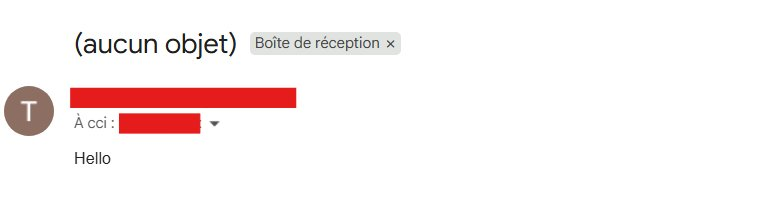
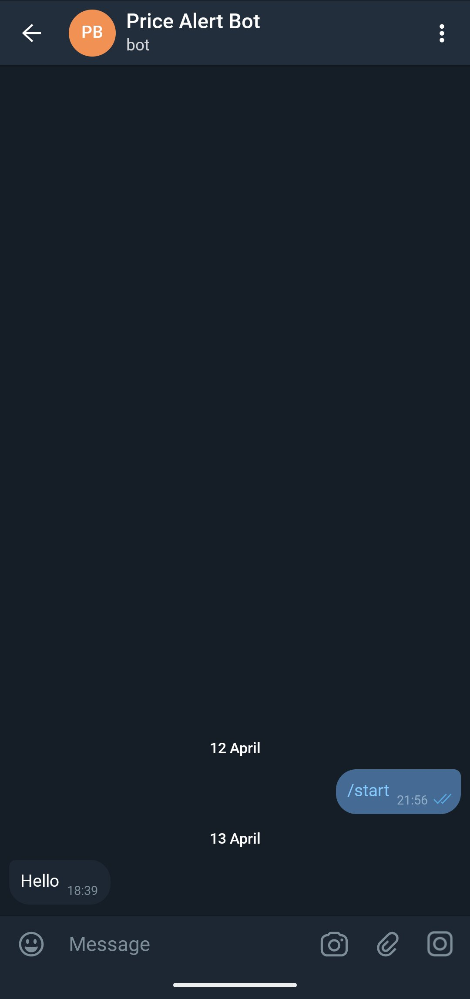

# 🛒 Price Alert Scraper

> Automatically track Amazon product prices and get notified via **Email** and **Telegram** when the price drops below your target.

---

## 📋 Features

- Scrape Amazon product prices automatically
- Send alerts via **Gmail** and **Telegram**
- Scheduler runs every day at a defined time
- Easy configuration via `.env` file

---

## 📸 Screenshots

### ✉️ Email Notification



### 💬 Telegram Notification



---

## 🗂️ Project Structure

```
price-alert-scraper/
├── main.py          # Entry point of the application
├── scheduler.py     # Schedules the daily price check
├── checker.py       # Compares price to target threshold
├── scrape.py        # Fetches and extracts price from Amazon
├── notifier.py      # Sends Email and Telegram notifications
├── .env             # Environment variables (never commit this)
├── .gitignore       # Ignores .env and other sensitive files
└── README.md        # Project documentation
```

---

## ⚙️ Installation

### 1. Clone the repository

```bash
git clone https://github.com/your-username/price-alert-scraper.git
cd price-alert-scraper
```

### 2. Install dependencies

```bash
pip install requests beautifulsoup4 schedule python-dotenv
```

### 3. Configure your `.env` file

Create a `.env` file at the root of the project :

```
EMAIL_SENDER=your_email@gmail.com
EMAIL_PASSWORD=your_app_password
EMAIL_RECEIVER=receiver_email@gmail.com
TELEGRAM_TOKEN=your_telegram_bot_token
TELEGRAM_CHAT_ID=your_chat_id
```

> ⚠️ For Gmail, you need to generate an **App Password** from your Google account settings.

---

## 🚀 Usage

Edit the target price and product URL in `main.py` :

```python
scheduler.runTask(5.5, "https://www.amazon.fr/dp/B01DN8TEA2")
```

Then run the script :

```bash
python main.py
```

The script will check the price every day at **9:00 AM** and send an alert if the price is below your target.

---

## 🔔 Notifications

### Email

Sends a detailed message with the product URL and target price via Gmail SMTP.

### Telegram

Sends an instant message to your Telegram bot with the product URL and current price.

---

## 🔒 Security

- Never commit your `.env` file to GitHub
- Add `.env` to your `.gitignore`
- Use Gmail **App Passwords** instead of your real password

---

## 🛠️ Tech Stack

| Tool             | Usage                 |
| ---------------- | --------------------- |
| `requests`       | HTTP requests         |
| `BeautifulSoup4` | HTML parsing          |
| `smtplib`        | Email notifications   |
| `schedule`       | Task scheduling       |
| `python-dotenv`  | Environment variables |

---

## 👤 Author

**Tao Serveaux**

---

## 📄 License

This project is for personal use only.
